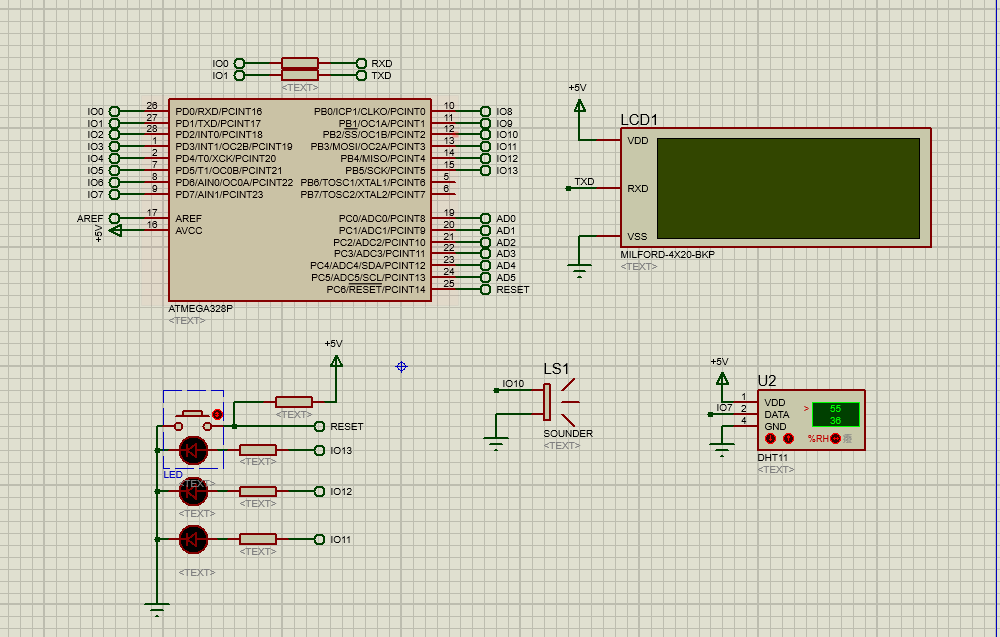
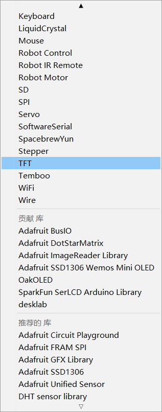
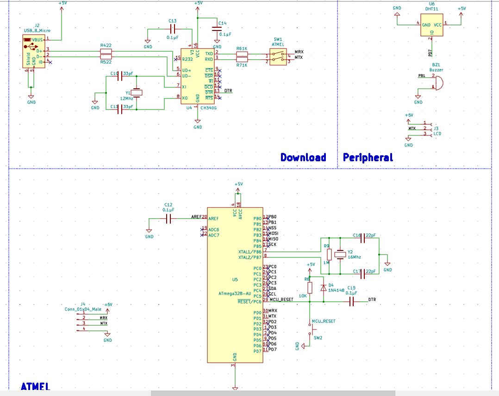
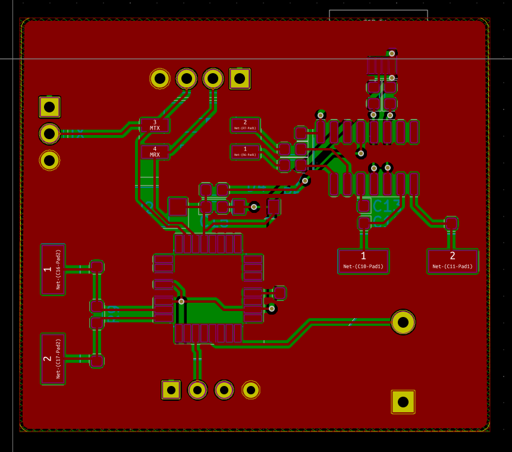
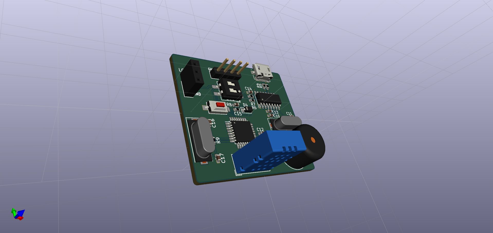
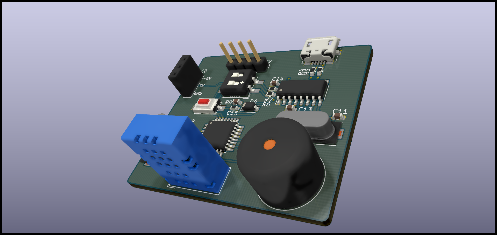

# EDA课设


> 大三刚开学就两次连续的课设，很难受，感觉课太多，不过这次EDA课设算是个福利，但是没学到什么东西……有两道题目，第一道是使用以前的数电知识完成的，没什么兴趣，第二个使用单片机，看下题目

```reStructuredText
题目二  温湿度采集器设计
本设计要求利用Proteus设计软件进行设计开发，运用单片机设计一个具有温湿度采集和显示功能的电路，并实现其仿真运行调试。最后通过查找相关器件的封装资料，把设计的电路在AD软件上画出原理图，封装库以及完整的PCB图。
功能简介
1.	实现学号（根据自己的完整学号）显示在LED数码管显示（或液晶），启动后显示本人学号
2.	实现温度，湿度的采集，并实时显示在液晶上。
3.	当温度高于35时，点亮一个绿色LED灯，当湿度高于55时，点亮一个黄色LED灯。当两者都高于限值时，点亮红色LED灯，并且蜂鸣器响起。
评分标准
所有学生必须实现以上所有功能并且画出原理图和PCB图，否者考评为“不及格”。在此基础上，将根据元器件布局、连接线分布是否合理、美观进行30分以内的加分。自行设计添加其他功能，将根据功能的实现难度及实用性另外进行10分以内的。
```

## 仿真&&代码

​	咋一看这个题目就想着用32去解决，但发现居然不熟悉Proteus，自己也因为做项目的原因，用的eclipse+C++的环境居然十分不熟悉，想着用RT-Thread Studio解决发现Proteus仿真居然出错！！！真的是X了！51单片机又太古老，已经一年多没去写过寄存器了，不想弄，毕竟大多数人做这个题目都是弄51，没意思呐！

​	看下Proteus还有什么芯片可以用，偶然间发现了Arduino！！！这不是更简单吗？开始写程序！！！

``` c++
#include <SerLCD.h>
#include <Wire.h>
#include <DHT.h>
#include <DHT_U.h>

#define DHTPin 7
#define LCDPin 8
#define GREEN 13
#define YELLOW 12
#define RED 11
#define BUZZER 10

DHT dht(DHTPin,DHT11);
SerLCD lcd;
//int i = 0;
// the setup function runs once when you press reset or power the board
void setup() {
  // initialize digital pin LED_BUILTIN as an output.
  Serial.begin(9600);
  dht.begin(); //DHT开始工作
  lcd.begin(Serial);

  lcd.setBacklight(255,255,255);
  lcd.setContrast(5);
  lcd.clear();
  
  pinMode(GREEN, OUTPUT);
  pinMode(YELLOW, OUTPUT);
  pinMode(RED, OUTPUT);
  Serial.print("201810224113");
  delay(2000);
}

// the loop function runs over and over again forever
void loop() {
  float h = dht.readHumidity();//读湿度
  float t = dht.readTemperature();//读温度，默认为摄氏度

  adjust(h,t);
  display(h,t);
}

void display(int h,int t)
{
  lcd.setCursor(0, 0);
  lcd.print("NO.201810224113");
  lcd.setCursor(0,1);
  lcd.print("Temperature:");
  lcd.setCursor(12,1);
  lcd.print(t);
  lcd.setCursor(0,2);
  lcd.print("Humidity:");
  lcd.setCursor(9,2);
  lcd.print(h);
  lcd.setCursor(0,3);
  lcd.print("Designed by:lfdcn");
}

void adjust(int h,int t)
{
    if(t>35&&h>55)
  {
    digitalWrite(GREEN,LOW);
    digitalWrite(YELLOW,LOW);
    digitalWrite(RED,HIGH);
    digitalWrite(BUZZER,HIGH);
  }
  else if(t>35)
  {
    digitalWrite(GREEN,HIGH);
    digitalWrite(RED,LOW);
    digitalWrite(YELLOW,LOW);
    digitalWrite(BUZZER,LOW);
  }
  else if(h>55)
  {
    digitalWrite(YELLOW,HIGH);
    digitalWrite(GREEN,LOW);
    digitalWrite(RED,LOW);
    digitalWrite(BUZZER,LOW);
  }
  else
  {
    digitalWrite(GREEN,LOW);
    digitalWrite(YELLOW,LOW);
    digitalWrite(RED,LOW);
    digitalWrite(BUZZER,LOW);
  }
}
```

这里其实有更好的方式去优化下代码，不至于看上去这么地肿……但是考虑到时间和我多年没写代码地原因，理解下，哈哈！！！、

**注释？这点代码还注释？？？**

这个用了DHT的库以及一个串口屏的库，这不是送分题吗？看下代码多方便，代码写得都不用1个钟（要配合电路设计），在看下我的Proteus的电路设计：



简单吧？Arduino的威力！以后万一要使用STM32、HC32、GD32什么的，直接移植它们的库啊！



## PCB设计

> 老本行了，本来都不想走硬件路线的，懂我的都懂……无敌的kicad

### 原理图设计



这个是用以前画的Arduino的板子修改来的，得心应手，一边回复小班的信息一边修改，还是蛮简单的，还加入了下载CH340电路，简直不要太好画！哦！不，就主要是删除之前的一些电机，一些接口，一些无线什么的功能而已！

### PCB设计



卧槽，咋一看这个布局怎么这么丑陋！好吧说实话是随便布的，就像J哥说的，这种频率的板子，怎么布不都一样？？？除了差分线注意一下，其它没什么注意的，毕竟之前画过这板子！哈哈！

什么？嫌丑？kicad没有自动布线，虽然丑，好歹也是自动布线的，老罗的板子还没完成呢，这个不管了，时间宝贵！写这篇Blog是为了聪哥


看下3D图吧：





看着可以吗兄弟们，用Arduino是投机取巧的办法，哈哈，过了就好，先过了再说！迟点再优化一下！

## 后续

有可能加入时钟的功能吧，懒得弄了，随便交差再说！睡觉！